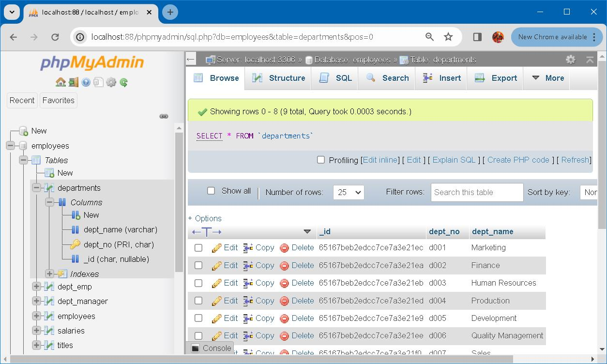
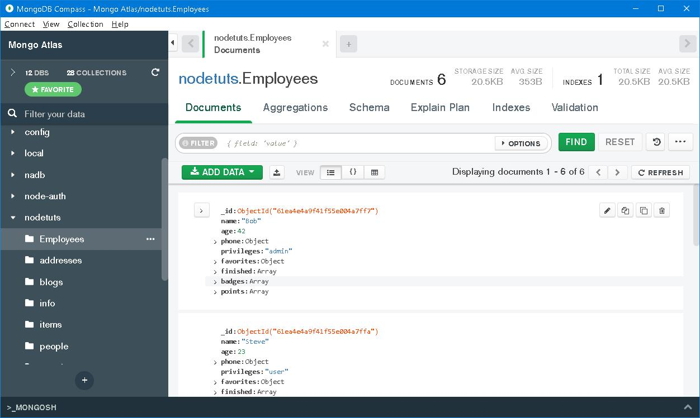
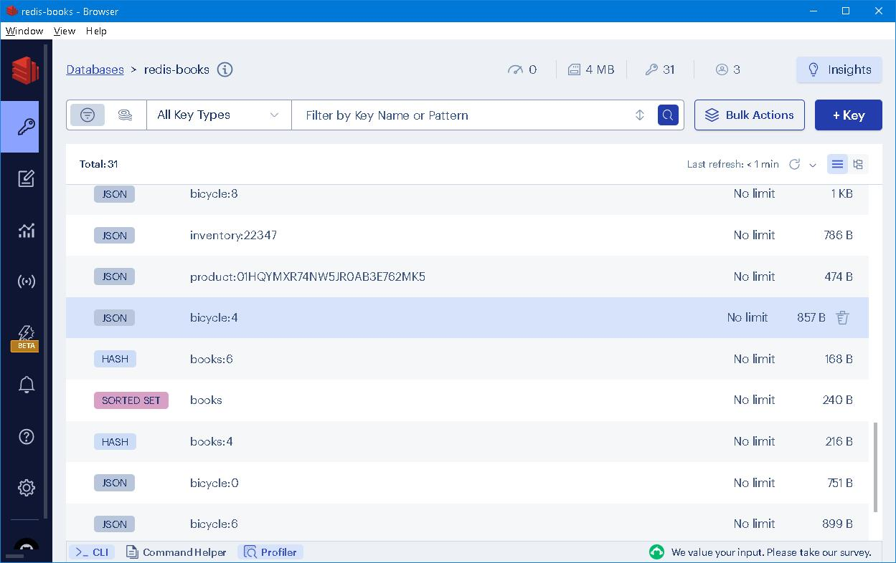

### Redis Stack aggregation pipeline <br />─── "Don't worry about being old, worry about thinking old"


### Prologue 
> Time was when travel-stained pilgrims rode in clattering parties through the city’s welcome shades; time is when wayfarers, leading a gipsy life between haymaking time and harvest, ... [more](https://www.gutenberg.org/cache/epub/564/pg564-images.html#chap19)


### I. Variation is invariant 
Ever since I made acquaintance with relational databases, things were kept in a well organized hierarchy, ie. database, schema, table, record, field... line by line and step by step along the way from top to down. Tables were *normalized*, indexes were extensively built to enforce *constraints* and further speed up file access. The power of aggregation it evinced was so unparalleled as to make all competitors tumbled down instantaneously. All in all, everything was tidy and clean. All went well... 



Three decades have passed since then... When I first scratched [MongoDB](https://www.mongodb.com/), similar hierarchy vaguely emerges from my soul, ie. database, collection, document, property... etc. Instead of grid of rigid rows, a more elastic JSON format is employed to enable property of array and embedded objects. [Aggregation](https://github.com/Albert0i/MongoDB-aggregation-pipeline/blob/main/README.md) can be devised ingeniously to pair with relational database, comprehensive and advanced are provided. 



Of late, I come access [Redis Stack](https://redis.io/docs/about/about-stack/), which is a new species from NoSQL family, makes me petrified and almost Loss of consciousness: **Everything iss kept on top-level**. The reason is obvious, by keeping them on the top level, a constant access time through primary keys is attained. This simplicity and speed have made it a popular choice for applications that require fast and efficient data access. 



In addition, Redis provides a rich set of data structures besides *key-value pairs*, such as *lists*, *sets*, *sorted sets*, *hashes*. These data structures offer efficient and flexible storage and retrieval of data. Use cases are caching, session management, real-time analytics, and job queues. 

---

> Redis has been designed to offer an alternative for problems where relational databases (RDBMSs) are not a good fit because there is something wrong if we use an RDBMS for all kinds of work. However, in comparison to other data storage options that became popular when the NoSQL wave shook the world of databases (Memcached, the key-value data store released in 2003, or MongoDB, the document store released in 2009, and many more), Redis has its roots in computer science and makes a rich variety of data structures available. This is one of the distinguishing features of Redis and the likely reason that fostered its adoption by software engineers and developers – presenting data structures such as hashes, lists, sets, bitmaps, and so on that are familiar to software engineers so they could transfer the programming logic to data modeling without any lengthy and computationally expensive data transformation. Viewed in this light, we could say that Redis is about persisting the data structures of a programming language.

IHMO, MongoDB competes with SQL Server; while Redis Stack compete with time and efficiency on it's own. 


### II.  [RedisJSON](https://github.com/RedisJSON/RedisJSON)
> RedisJSON is a Redis module that implements ECMA-404 The JSON Data Interchange Standard as a native data type. It allows storing, updating and fetching JSON values from Redis keys (documents).


### III. [RediSearch](https://github.com/RediSearch/RediSearch)
> However, if in addition to the ability to use core data structures to store the data, we ensure that fast searches can be performed (besides primary key lookup), it is possible to think beyond the basic caching use case and start looking at Redis as a full-fledged database, capable of high-speed searches.

> Redis Stack complements Redis with the ability to create secondary indexes on Hashes or JSON documents, the two document types supported by Redis Stack. The search examples seen so far can be resolved with the indexing features.

> RediSearch is a Redis module that provides querying, secondary indexing, and full-text search for Redis. To use RediSearch, you first declare indexes on your Redis data. You can then use the RediSearch query language to query that data.


### IV. [Aggregation](https://redis.io/docs/interact/search-and-query/advanced-concepts/aggregations/)


[Here](https://redis.io/docs/interact/search-and-query/query/) is a short SQL comparison using the [bicycle dataset](https://redis.io/docs/interact/search-and-query/query/data/bicycles.txt):

| Type | SQL | Redis Stack |
| ----------- | ----------- | --- |
| Selection | SELECT * FROM bicycles WHERE price >= 1000 | FT.SEARCH idx:bicycle "@price:[1000 +inf]"  | 
| Simple projection | SELECT id, price FROM bicycles | FT.SEARCH idx:bicycle "*" RETURN 2 __key, price |
| Calculated projection | SELECT id, price-price*0.1 AS discounted FROM bicycles | FT.AGGREGATE idx:bicycle "*" LOAD 2 __key price APPLY "@price-@price*0.1" AS discounted |
| Aggregation | SELECT condition, AVG(price) AS avg_price FROM bicycles GROUP BY condition | FT.AGGREGATE idx:bicycle "*" GROUPBY 1 @condition REDUCE AVG 1 @price AS avg_price |

```
FT.AGGREGATE bicycle:index * 
    LOAD 3 __key brand model     
    APPLY 'format("%s-%s", @brand, @model)' AS name     
    GROUPBY 1 @condition     
    REDUCE TOLIST 1 @__key AS keys 
    REDUCE TOLIST 1 @name AS names 
    REDUCE COUNT 0 AS num 
    REDUCE SUM 1 @price AS money
    SORTBY 2 @num DESC 
    LIMIT 0 10 
```

### V. Reference
1. [Redis Stack Tutorial](https://youtu.be/McPR39mkp7w)
2. [Redis Stack for Application Modernization](https://www.amazon.com/Redis-Stack-Application-Modernization-applications/dp/1837638187)
3. [The Mystery of Edwin Drood](https://www.gutenberg.org/cache/epub/564/pg564-images.html)


### Epilogue
> Abstract thought has formed the basis of innovation and creativity throughout human existence, and can therefore be seen as one of humanity’s most characteristic defining features. [more](https://bc805.medium.com/abstract-thought-how-is-it-significant-and-how-does-it-define-the-basis-for-modern-humanity-a98a5b92fb9f)


### EOF (2024/03/13)