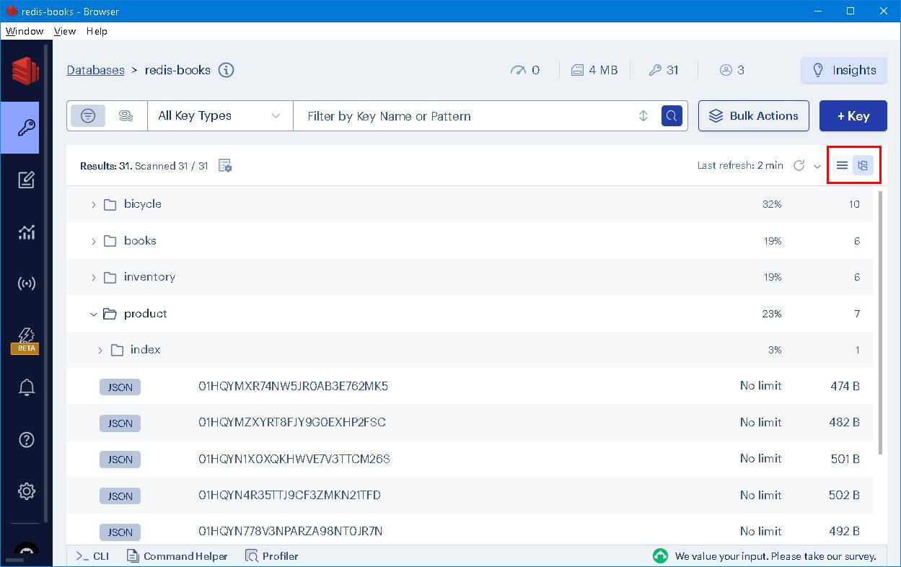
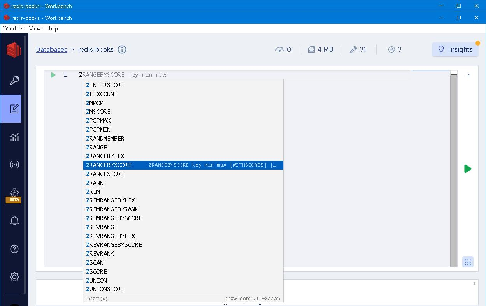

### Redis Stack aggregation pipeline <br />─── "Don't worry about being old, worry about thinking old"


### Prologue 
> Abstract thought has formed the basis of innovation and creativity throughout human existence, and can therefore be seen as one of humanity’s most characteristic defining features. The ability to think outside our immediate cultural setting and surroundings, beyond basic needs like eating, sleeping and reproducing, is indicative of a higher degree of thought. 


### I. Metamorphosis
[Relational database](https://lc.fie.umich.mx/~rodrigo/BD/An%20Introduction%20to%20Database%20Systems%208e%20By%20C%20J%20Date.pdf), being the dominant means in morden computing society during the past few decades, much adversely to it's optimistic anticipation, confronts with palpable menace of [NoSQL](https://www.mongodb.com/nosql-explained), which is increasingly used in big data and real-time web/mobile applications. The fact that mainstream RDBMS such as [Oracle](https://www.oracle.com/database/), [MySQL](https://www.mysql.com/) and [Microsoft SQL Server](https://www.microsoft.com/en-us/sql-server/sql-server-2022) starts to support [JSON Data Types](https://www.w3schools.com/js/js_json_datatypes.asp), reconfirms the impending necessity of storing, retrieving as well as processing JSON data. 

We have been taught to organize things in hierarchy since early childhood, which embodies a certain level of *abstraction*. Commanding over RDBMS, we could see schema, table, row, field all the way down from top to bottom.


Similarly, we could see schema, collection, document, property in NoSQL counterpart. 


In a word, [Redis Stack](https://redis.io/docs/about/about-stack/), backed by [Redis](https://redis.io/) technique, is a promising new species of NoSQL family. Have a look of [RedisInsight](https://redis.com/redis-enterprise/redis-insight/), one would petrified at realizing that of *all sorts of data are stored at the very top level*. 


The reason is simple, by keeping everything on the top level, a constant access time is attained using primary key access, this make Redis a good candidate for application which requires extremely fast response time. In addition to *key-value pair*, Redis provides abundant data structures such as *list*, *set*, *sorted set*, *hash* etc. Add-on *RediJSON* module enables manipulation of JSON objects effectively; *RediSearch* module enables searching complex JSON objects using secondary index, which renders a tremendous utility boost and virtually evolves towards a full-fledged multi-model database. 

RedisInsight has a *List View* and *Tree view* options to *visually* mock-up everything provided that objects are named properly and consistently. 



Most RDBMS supports large quantity of [datatypes](https://www.w3schools.com/mysql/mysql_datatypes.asp), this mainly pertains to storage allocation, while the underpinning datatype in Redis is *string*, the real power of it lays in intrinsic [Abstract Data Type](https://en.wikipedia.org/wiki/Abstract_data_type). To solve any non-trivial problem, certain data structures have to be involved and all modern programming languages equipped with libraries to handle queue, stack, list, dictionary, collection,... etc. but Redis provides them out of the box in teh database level. 


Colon (\:) character is commonly used as a delimiter in Redis key nomenclature to separate different parts or levels of the key. Here are a few reasons why colons are used:

1. **Hierarchical Organization**: Colons can be used to create a hierarchical structure in key names. Each segment separated by a colon represents a different level or category of the key. This helps in organizing related keys and establishing a logical hierarchy.

   Example: `user:123:name`
   - "user" is the top-level namespace or category.
   - "123" represents a specific user ID.
   - "name" indicates the purpose of the stored data.

2. **Namespace Separation**: Colons can be used to distinguish different namespaces or categories of keys. By using a common prefix followed by a colon, you can group related keys together and avoid naming conflicts.

   Example: `cache:user:123:name`
   - "cache" represents the namespace for caching related keys.
   - "user" indicates the category or type of data being cached.
   - "123" represents a specific user ID.
   - "name" specifies the purpose of the cached data.

3. **Readability and Clarity**: Colons enhance the readability and clarity of key names. They act as visual separators, making it easier to identify different parts or elements within a key and understand its structure without additional context.

   Example: `order:123:status`
   - "order" indicates the category or type of data.
   - "123" represents a specific order ID.
   - "status" specifies the purpose of the stored data.

While colons are a common choice for delimiters in Redis key nomenclature, you can also use other delimiters like dots (.), dashes (-), or any other character that suits your naming conventions and requirements. The key is to choose a delimiter that clearly separates different components of the key and aligns with the organization and readability of your data. (Generated by ChatGPT)

In addition, the `SELECT index` command is used to switch between different logical databases within a Redis instance. Redis allows you to have multiple databases identified by indexes, numbered from 0 to 15 by default. Once you execute the SELECT command, all subsequent Redis commands will operate on the selected database until you issue another SELECT command to switch to a different database. (Generated by ChatGPT)

It's important to note that Redis databases are isolated from each other, meaning data stored in one database will not be accessible from another database. Each database has its own keyspace, and operations performed on one database will not affect the data in other databases. (Generated by ChatGPT)

**caveat** 

Redis Cluster only supports logical database 0 and currently not all libraries support logical database. 

---

> Redis Stack is an extension of Redis presented in 2022, which introduces JSON, vector, and time series data modeling capabilities, all supporting real-time queries and searches. Redis Stack represents a new approach to providing a rich data modeling experience all within the same database server. It introduces features such as vector similarity search to query structured and unstructured data (for example, text, images, or audio files) and delivers probabilistic Bloom filters to efficiently resolve recurrent big data problems. Redis Stack is also a data platform that supports event-driven programming and introduces stream processing features


### II. [RedisJSON](https://github.com/RedisJSON/RedisJSON)
Flat JSON object can be stored in hash using [HSET](https://redis.io/commands/hset/): 
```
HSET books:1 title "The Mystery of Edwin Drood" rating 8  author "Charles Dickens" blurb "The last and unfinished story the the author"  
HSET books:2 title "The Complete Tales and Poem" rating 9  author "Edgar Allan Poe" blurb "The complete collection of the author"  
HSET books:3 title "The Brothers Karamazov" rating 9  author "Fyodor Dostoyevsky" blurb "The first part the an unfinished story. (1/3)"  
```

But there is a catch, you can't have numeric, boolean, array field and embedded object, which greatly impedes its usability. To store real JSON object, you need *RedisJSON* module installed. 
```
JSON.SET inventory:12345 $ '{ 
        "name": "Noise-cancelling Bluetooth headphones",
        "category": "headphone", 
        "description": "Wireless Bluetooth headphones with noise-cancelling technology",
        "wireless": true,
        "connection": "Bluetooth",
        "price": 78.99,
        "stock": 25,
        "free-shipping": true,
        "colors": [
          "black",
          "silver",
          "pink"
        ]
    }' 
```
Here's a summary of RedisJSON commands:

| Command                | Description                                     | Example                                                      |
|------------------------|-------------------------------------------------|--------------------------------------------------------------|
| JSON.SET               | Sets the value of a key as a JSON object/array   | JSON.SET key . '{"name": "John", "age": 30}'                 |
| JSON.GET               | Retrieves the value of a key as a JSON object/array | JSON.GET key                                              |
| JSON.TYPE              | Returns the type of the value at a key           | JSON.TYPE key                                                |
| JSON.ARRAPPEND         | Appends one or more JSON values to an array      | JSON.ARRAPPEND key . '{"name": "Alice"}' '{"name": "Bob"}'   |
| JSON.ARRINSERT         | Inserts a JSON value into an array               | JSON.ARRINSERT key . 1 '{"name": "Charlie"}'                 |
| JSON.ARRLEN            | Returns the length of an array                   | JSON.ARRLEN key                                              |
| JSON.OBJLEN            | Returns the number of keys in an object          | JSON.OBJLEN key                                              |
| JSON.OBJKEYS           | Returns the keys of an object                    | JSON.OBJKEYS key                                             |
| JSON.NUMINCRBY         | Increments a numeric value in a JSON document    | JSON.NUMINCRBY key .value 5                                   |
| JSON.STRAPPEND         | Appends a string to a string value in a JSON document | JSON.STRAPPEND key .message " World"                   |

(Generated by ChatGPT)


### III. [RediSearch](https://github.com/RediSearch/RediSearch)
Index have to be built before searching is made. 
```
FT.CREATE bicycle:index ON 
    JSON PREFIX 1 bicycle: SCORE 1.0 SCHEMA 
    $.pickup_zone AS pickup_zone GEOSHAPE 
    $.store_location AS store_location GEO 
    $.brand AS brand TAG 
    $.model AS model TAG 
    $.description AS description TEXT WEIGHT 1.0 
    $.price AS price NUMERIC 
    $.condition AS condition TAG SEPARATOR , 
```

> An index structure is defined by a schema. The [schema](https://redis.io/docs/interact/search-and-query/basic-constructs/schema-definition/) specifies the fields, their types, whether they should be indexed or stored, and other additional configuration options. By properly configuring the schema, you can optimize search performance and control the storage requirements of your index.

> Number fields are used to store non-textual, countable values. They can hold integer or floating-point values. Number fields are sortable, meaning you can perform range-based queries and retrieve documents based on specific numeric conditions.

> Tag fields are used to store textual data that represents a collection of data tags or labels. Tag fields are characterized by their low cardinality, meaning they typically have a limited number of distinct values. Unlike text fields, tag fields are stored as-is without tokenization or stemming. They are useful for organizing and categorizing data, making it easier to filter and retrieve documents based on specific tags.

> Text fields are specifically designed for storing human language text. When indexing text fields, Redis Stack performs several transformations to optimize search capabilities. The text is transformed to lowercase, allowing case-insensitive searches. The data is tokenized, meaning it is split into individual words or tokens, which enables efficient full-text search functionality. Text fields can be weighted to assign different levels of importance to specific fields during search operations. Additionally, text fields can be sorted based on their values, enabling the sorting of search results by relevance or other criteria.

[Here](https://redis.io/docs/interact/search-and-query/query/) is a short SQL comparison using the [bicycle dataset](https://redis.io/docs/interact/search-and-query/query/data/bicycles.txt):

| Type | SQL | Redis Stack |
| ----------- | ----------- | --- |
| Selection | SELECT * FROM bicycles WHERE price >= 1000 | FT.SEARCH idx:bicycle "@price:[1000 +inf]"  | 
| Simple projection | SELECT id, price FROM bicycles | FT.SEARCH idx:bicycle "*" RETURN 2 __key, price |
| Calculated projection | SELECT id, price-price*0.1 AS discounted FROM bicycles | FT.AGGREGATE idx:bicycle "*" LOAD 2 __key price APPLY "@price-@price*0.1" AS discounted |
| Aggregation | SELECT condition, AVG(price) AS avg_price FROM bicycles GROUP BY condition | FT.AGGREGATE idx:bicycle "*" GROUPBY 1 @condition REDUCE AVG 1 @price AS avg_price |


### IV. [Aggregation](https://redis.io/docs/interact/search-and-query/advanced-concepts/aggregations/) 
**caveat** 

Aggretation in Redis Stack is strictly index based, which means there is no such thing as [SQL join](https://www.w3schools.com/sql/sql_join.asp), neither [\$lookup](https://www.mongodb.com/docs/manual/reference/operator/aggregation/lookup/) nor [\$unwind](https://www.mongodb.com/docs/manual/reference/operator/aggregation/unwind/) operations as in MongoDB could have. 

The complete syntax is formidable: 
```
FT.AGGREGATE index query 
  [VERBATIM] 
  [LOAD count field [field ...]] 
  [TIMEOUT timeout] 
  [ GROUPBY nargs property [property ...] [ REDUCE function nargs arg [arg ...] [AS name] [ REDUCE function nargs arg [arg ...] [AS name] ...]] ...]] 
  [ SORTBY nargs [ property ASC | DESC [ property ASC | DESC ...]] [MAX num] [WITHCOUNT] 
  [ APPLY expression AS name [ APPLY expression AS name ...]] 
  [ LIMIT offset num] 
  [FILTER filter] 
  [ WITHCURSOR [COUNT read_size] [MAXIDLE idle_time]] 
  [ PARAMS nargs name value [ name value ...]] 
  [DIALECT dialect]
```

The good news is: once you become familiar with how [FT.SEARCH](https://redis.io/commands/ft.search/) works and if you are familar with [Aggregation pipeline in MongoDB](https://youtu.be/vx1C8EyTa7Y), you are already half way done... 

SQL
```
SELECT condition, count(*) AS num, sum(price) AS money
FROM bicycles 
GROUP BY condition
ORDER BY 2
OFFSET 0 LIMIT 10;  
```

Redis Stack 
```
FT.AGGREGATE bicycle:index *     
    GROUPBY 1 @condition     
    REDUCE COUNT 0 AS num 
    REDUCE SUM 1 @price AS money
    SORTBY 2 @num DESC 
    LIMIT 0 10
```


Elaborate more: 
```
FT.AGGREGATE bicycle:index * 
    LOAD 3 __key brand model
    APPLY 'format("%s-%s", @brand, @model)' AS name     
    GROUPBY 1 @condition     
    REDUCE TOLIST 1 @__key AS keys 
    REDUCE TOLIST 1 @name AS names 
    REDUCE COUNT 0 AS num 
    REDUCE SUM 1 @price AS money
    SORTBY 2 @num DESC 
    LIMIT 0 10 
```


Here's a comparison of aggregation pipeline in MongoDB and Redis Stack:

| Feature                           | MongoDB                                                | FT.AGGREGATE |
|-----------------------------------|--------------------------------------------------------|--------------------------------------------|
| Purpose                           | Data aggregation and transformation                    | Full-text search and aggregation            |
| Data Source                       | MongoDB collections and documents                      | RediSearch indexes and documents           |
| Syntax                            | JSON-like syntax with stages and operators             | Command-based syntax with stages and filters|
| Core Operations                   | Filtering, grouping, sorting, projecting, joining, etc.| Filtering, sorting, grouping, aggregating  |
| Joining                           | `$lookup` operator for joining collections             | N/A (FT.AGGREGATE does not support joins)       |
| Full-Text Search                  | N/A (MongoDB has a separate full-text search feature)  | Supported with RediSearch indexes           |
| Performance                       | Efficient for complex data manipulations               | Designed for fast full-text search          |
| Pipelining and Chaining           | Multiple stages can be chained together                | Multiple stages can be chained together     |
| Aggregation Functions             | `$sum`, `$avg`, `$min`, `$max`, `$count`, etc.        | `SUM`, `AVG`, `MIN`, `MAX`, `COUNT`, etc.   |
| Custom Functions                  | Supports custom JavaScript functions                   | Supports custom Lua scripts                 |
| Query Language and Syntax         | MongoDB Query Language (MQL)                           | Command-based syntax similar to Redis       |

Both MongoDB's aggregation pipeline and Redis Stack FT.AGGREGATE pipeline provide powerful data manipulation and analysis capabilities, their primary focus and design differ. MongoDB's aggregation pipeline is a versatile tool for aggregating and transforming data within the database, while FT.AGGREGATE pipeline is primarily designed for fast full-text search and aggregation operations on RediSearch indexes.

(Generated by ChatGPT)


### V. Introspection 
When I made acquaintance with *Redis* several years ago, it was solely for session store of my NodeJS app. Not until recently do I hear of, know of, *Redis Stack* which targets *primary database*. The more I learn about Redis, the more I appreciate it's design simplicity and performance achieved. 

*Key-value pair*, *List*, *Set*, *Hash* and especially [*Sorted Set*](https://redis.io/docs/data-types/sorted-sets/), when apply properly, can solve many complicated real world issues which would otherwise renders awkward clumsiness in rigid relational databases. List, per se, can implement *stack* and *queue* which are common useful data structure, while Set is a natural choice for data *de-duplication*. As for Sorted Set, one use case I have come up with is the application of some public resource: 

- Base on each applicant, a score is calculated according to a pre-defined formula; 
- All applicants are queued up according to the score in descending order; 
- Applicants with the same score will be ordered randomly in the same *score-group*; 
- Applicants can be added or removed at anytime; 
- Applicants can change their status and hence a new score is re-calculate and re-position could happen at anytime; 
- Applicants can check their current position (rank) in queue at any time; 
- A list of ordered applicants can be generated at any time. 

In RDBMS, a queuing table has to be setup and somehow maintained on every data change. 
| App. number | Score | Position |
| -------- | --- | --- |
| 20240077 | 250 | 1 | 
| 20240155 | 237 | 2 |
| 20240102 | 230 | 3 |
| ... | ... | ... |

These can be done *realtime* on-demand, by database trigger or by scheduled job. 

However, using Sorted Set to add 12 applicants, ie. `ZADD score value`: 
```
ZADD queue:123 157.322 20240007
ZADD queue:123 210.015 20240012
ZADD queue:123 128.580 20240002
ZADD queue:123 250.477 20240077
ZADD queue:123 237.831 20240155
ZADD queue:123 097.664 20240038
ZADD queue:123 125.481 20240052
ZADD queue:123 175.225 20240025
ZADD queue:123 198.137 20240032
ZADD queue:123 175.588 20240087
ZADD queue:123 230.645 20240102
ZADD queue:123 211.332 20240130
```
Value before decimal point is actual calculated score; value after decimal point is random number. 

To find out the size of the queue: 
```
ZCARD queue:123
```

To count by score range:
```
ZCOUNT queue:123 1 100
ZCOUNT queue:123 101 200
ZCOUNT queue:123 201 300
```

To find out current position (zero-based) of App. number `20240025`:  
```
ZREVRANK queue:123 20240025
```


To list out the whole queue (zero-based):
```
ZREVRANGE queue:123 0 -1 WITHSCORES
```


As yo can see, there a whole bunch of operations when working with Sorted Set in Redis. 




### VI. Reference
1. [Redis Stack Tutorial](https://youtu.be/McPR39mkp7w)

2. [Redis Stack for Application Modernization](https://www.amazon.com/Redis-Stack-Application-Modernization-applications/dp/1837638187)

3. [Redis and JSON Explained (Revisited)](https://youtu.be/I-ohlZXXaxs?list=PL83Wfqi-zYZHtpd4Glbj-NBIz7RB0Jw5u)

4. [Querying, Indexing, and Full-text Search in Redis](https://youtu.be/infTV4ifNZY?list=PL83Wfqi-zYZHtpd4Glbj-NBIz7RB0Jw5u)

5. [‘Abstract thought’ -How is it significant and how does it define the basis for modern humanity?](https://bc805.medium.com/abstract-thought-how-is-it-significant-and-how-does-it-define-the-basis-for-modern-humanity-a98a5b92fb9f)

6. [The Mystery of Edwin Drood](https://www.gutenberg.org/cache/epub/564/pg564-images.html)


### Epilogue
> Time was when travel-stained pilgrims rode in clattering parties through the city’s welcome shades; time is when wayfarers, leading a gipsy life between haymaking time and harvest, ...


### EOF (2024/03/19)
