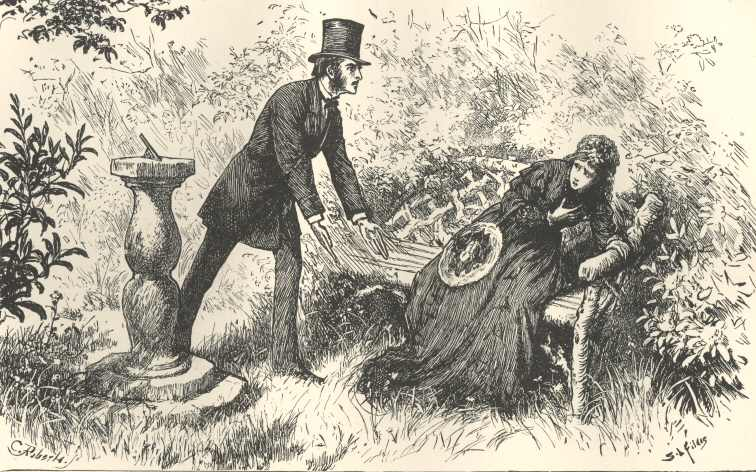

### Redis Stack aggregation pipeline  ─── "Don't worry about being old, worry about thinking old"

### Prologue 
> Abstract thought has formed the basis of innovation and creativity throughout human existence, and can therefore be seen as one of humanity’s most characteristic defining features. The ability to think outside our immediate cultural setting and surroundings, beyond basic needs like eating, sleeping and reproducing, is indicative of a higher degree of thought. 

### I. Metamorphosis
[Relational database](https://lc.fie.umich.mx/~rodrigo/BD/An%20Introduction%20to%20Database%20Systems%208e%20By%20C%20J%20Date.pdf), being the dominant means in morden computing society during the past few decades, much adversely to it's optimistic anticipation, confronts with palpable menace of [NoSQL](https://www.mongodb.com/nosql-explained), which is increasingly used in big data and real-time web/mobile applications. The fact that mainstream RDBMS such as [Oracle](https://www.oracle.com/database/), [MySQL](https://www.mysql.com/) and [Microsoft SQL Server](https://www.microsoft.com/en-us/sql-server/sql-server-2022) starts to support [JSON Data Types](https://www.w3schools.com/js/js_json_datatypes.asp), reconfirms the impending necessity of storing, retrieving as well as processing JSON data. 

We have been taught to organize things in hierarchy since early childhood, which embodies a certain level of *abstraction*. Commanding over RDBMS, we could see schema, table, row, field all the way down from top to bottom.

Similarly, we could see schema, collection, document, property in NoSQL counterpart. 

In a word, [Redis Stack](https://redis.io/docs/about/about-stack/), backed by [Redis](https://redis.io/) technique, is a promising new species of NoSQL family. Have a look of [RedisInsight](https://redis.com/redis-enterprise/redis-insight/), one would petrified at the seeing of *all sorts of data are stored at the very top level*. 

The reason is simple, by keeping everything on the top level, a constant access time is attained using primary key access, this make Redis a good candidate for application which requires extremely fast response time. In addition to key-value pair, Redis provides abundant data structures such as list, set, sorted set, hash etc. Add on RediJSON module enables manipulation of JSON objects effectively; RediSearch module enables searching complex JSON objects using secondary index, which renders a tremendous utility boost and virtually evolves towards a full-fledged multi-model database. 

> Redis Stack is an extension of Redis presented in 2022, which introduces JSON, vector, and time series data modeling capabilities, all supporting real-time queries and searches. Redis Stack represents a new approach to providing a rich data modeling experience all within the same database server. It introduces features such as vector similarity search to query structured and unstructured data (for example, text, images, or audio files) and delivers probabilistic Bloom filters to efficiently resolve recurrent big data problems. Redis Stack is also a data platform that supports event-driven programming and introduces stream processing features

The colon (:) character is commonly used as a delimiter in Redis key nomenclature to separate different parts or levels of the key. Here are a few reasons why colons are used:

1. **Hierarchical Organization**: Colons can be used to create a hierarchical structure in key names. Each segment separated by a colon represents a different level or category of the key. This helps in organizing related keys and establishing a logical hierarchy.

   Example: `user:123:name`
   - "user" is the top-level namespace or category.
   - "123" represents a specific user ID.
   - "name" indicates the purpose of the stored data.

2. **Namespace Separation**: Colons can be used to distinguish different namespaces or categories of keys. By using a common prefix followed by a colon, you can group related keys together and avoid naming conflicts.

   Example: `cache:user:123:name`
   - "cache" represents the namespace for caching related keys.
   - "user" indicates the category or type of data being cached.
   - "123" represents a specific user ID.
   - "name" specifies the purpose of the cached data.

3. **Readability and Clarity**: Colons enhance the readability and clarity of key names. They act as visual separators, making it easier to identify different parts or elements within a key and understand its structure without additional context.

   Example: `order:123:status`
   - "order" indicates the category or type of data.
   - "123" represents a specific order ID.
   - "status" specifies the purpose of the stored data.

While colons are a common choice for delimiters in Redis key nomenclature, you can also use other delimiters like dots (.), dashes (-), or any other character that suits your naming conventions and requirements. The key is to choose a delimiter that clearly separates different components of the key and aligns with the organization and readability of your data.

clear
flushdb
set student:1:name alberto
set student:1:age 18
scan 0 match student:* 
type student:1:age
incrby student:1:age 10
get student:1:age 
del student:1:age
keys *
select 1
keys *

### II. [RedisJSON](https://github.com/RedisJSON/RedisJSON)

### III. [RediSearch](https://github.com/RediSearch/RediSearch)

### IV. [Aggregation](https://redis.io/docs/interact/search-and-query/advanced-concepts/aggregations/) 

### V. Command summary

### VI. Introspection 

### VII. Reference
1. [Redis Stack Tutorial](https://youtu.be/McPR39mkp7w)

2. [Redis Stack for Application Modernization](https://www.amazon.com/Redis-Stack-Application-Modernization-applications/dp/1837638187)

3. [Redis and JSON Explained (Revisited)](https://youtu.be/I-ohlZXXaxs?list=PL83Wfqi-zYZHtpd4Glbj-NBIz7RB0Jw5u)

4. [Querying, Indexing, and Full-text Search in Redis](https://youtu.be/infTV4ifNZY?list=PL83Wfqi-zYZHtpd4Glbj-NBIz7RB0Jw5u)

5. [‘Abstract thought’ -How is it significant and how does it define the basis for modern humanity?](https://bc805.medium.com/abstract-thought-how-is-it-significant-and-how-does-it-define-the-basis-for-modern-humanity-a98a5b92fb9f)

6. [The Mystery of Edwin Drood](https://www.gutenberg.org/cache/epub/564/pg564-images.html)

### Epilogue
> Time was when travel-stained pilgrims rode in clattering parties through the city’s welcome shades; time is when wayfarers, leading a gipsy life between haymaking time and harvest, ...

### EOF (2024/03/15)
