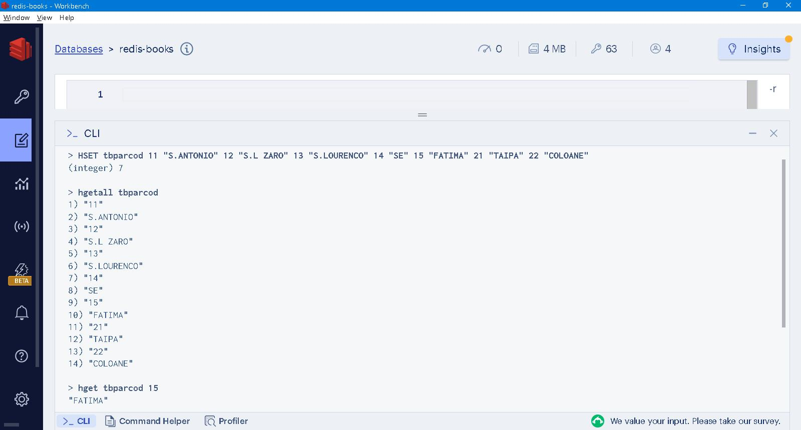
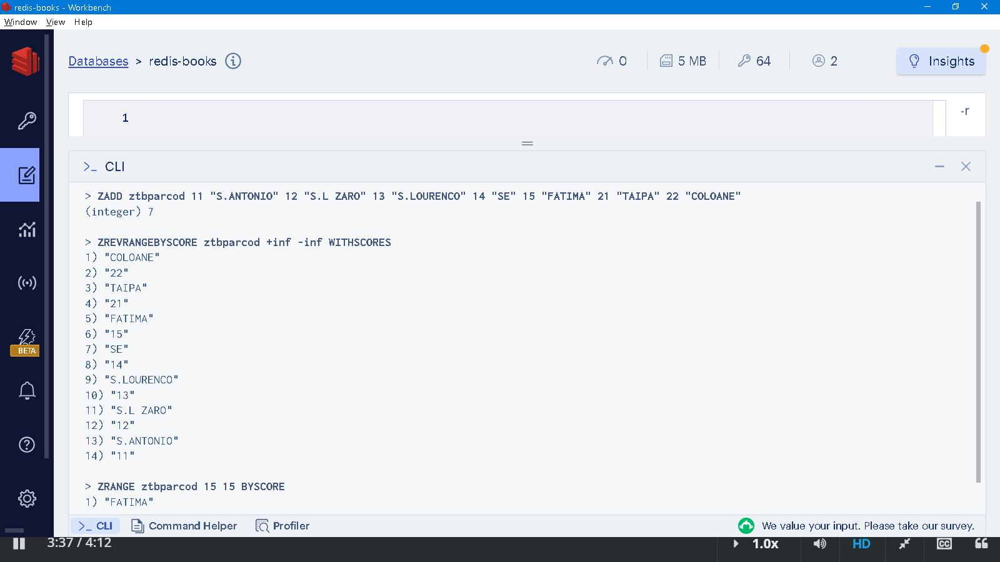

### Thinking in Redis<br />───The way to document database

「No kidding! There is no such thing as [SQL injection](https://www.w3schools.com/sql/sql_injection.asp) whatsoever if you opt not SQL at all...」

「Not a database as yet more than a database...」

「dementia ephemeral retrofit...」


### Prologue 
Rectangle is defined by four sides and four right angles, which makes it easy to understand and intuitive to use. By combining multiple rectagles vertically and horizontally, this effectively forms a *table*, each small rectangle instead becomes a *cell* of the whole. Table is a rigid data  structure in nature because of it's width, height and thus number of cells, operations are either first by horizontal *row* or by vertical *column* and then down into individual cell. While rectangle, per se, is a geometric concept, table is a data structure, a *matrix* in mathematics. Other structures such as *List*, *Set* and *Hash* bears their own topology, operations varies to a shocking extend... 

### I. A piece of cake...? Not so!  
[Database normalization](https://en.wikipedia.org/wiki/Database_normalization) is so common a practice to be carried out in table design of day-to-day life. Setting up a trivial code table is a drudgery, ie: 

| parcod | pardes |
| ------ | ------ |
| 11 | S.ANTONIO |
| 12 | S.L ZARO |
| 13 | S.LOURENCO |
| 14 | SE |
| 15 | FATIMA |
| 21 | TAIPA |
| 22 | COLOANE |

```
CREATE TABLE tbparcod
   (
    parcod CHAR(2) NOT NULL, 
    pardes CHAR(12), 

    CONSTRAINT tbparcod_pk PRIMARY KEY (parcod)
   );

INSERT INTO tbparcod(parcod, pardes) values('11', 'S.ANTONIO');
INSERT INTO tbparcod(parcod, pardes) values('12', 'S.L ZARO');
INSERT INTO tbparcod(parcod, pardes) values('13', 'S.LOURENCO');
INSERT INTO tbparcod(parcod, pardes) values('14', 'SE');
INSERT INTO tbparcod(parcod, pardes) values('15', 'FATIMA');
INSERT INTO tbparcod(parcod, pardes) values('21', 'TAIPA');
INSERT INTO tbparcod(parcod, pardes) values('22', 'COLOANE');
```

To retrieve the whole table and individual record: 
```
SELECT * FROM tbparcod;

SELECT pardes FROM tbparcod WHERE parcod='15';
```

Using [hash](https://redis.io/commands/?group=hash) to store flat file is straightforward: 
```
HSET tbparcod 11 "S.ANTONIO" 12 "S.L ZARO" 13 "S.LOURENCO" 14 "SE" 15 "FATIMA" 21 "TAIPA" 22 "COLOANE"
```

To retrieve the whole table and individual record is a breeze:
```
HGETALL tbparcod

HGET tbparcod 15
```



The **Time complexity** of [HGETALL](https://redis.io/commands/hgetall/) is O(N) where N is the size of the hash; [HGET](https://redis.io/commands/hget/) is O(1). It doesn't mean a lot when table is small in size, but if your table grows up to 10,000 records, the time involved does matter. 

> In traditional SQL databases, you have two types of general queries: queries scanning an entire table (or multiple tables) or queries using an index. Table scans are O(N) while fully indexed queries are O(lg N).

The term "lg" represents the logarithm function with a base of 2. It is often called the *binary logarithm*. We can rewrite it as:

O(log2 10,000) = log(10,000) / log(2) ≈ 13.29

So to speak, when n = 10,000, the time complexity O(lg n) is approximately 13.29, which means that the algorithm or operation requires up to 14 iterations or comparisons before the search is completed. That also means the index tree is 14 levels in depth, besides occupying disk space, *re-balancing* has to be performed whenever necessary. 

*Constant access time* refers to the property or characteristic of a data structure or algorithm where the time taken to access or retrieve an element or perform an operation remains constant, regardless of the size or scale of the data. To put it simple, the time to retrieve one record among 10 or 10,000 records is the same. 

However, chances are when you are requested to show the table in order of some sort, such as: 
```
SELECT * FROM tbparcod ORDER BY parcod DESC; 
```

It is miserable to confess that you can't make it! While [hash](https://redis.io/commands/?group=hash) being a fast and convenient data structure, doesn't have the faintest idea of ordering. If it is required to maintain the order, a more dedicated [Sorted Set](https://redis.io/commands/?group=sorted-set) may be an obvious better choice: 
```
ZADD ztbparcod 11 "S.ANTONIO" 12 "S.L ZARO" 13 "S.LOURENCO" 14 "SE" 15 "FATIMA" 21 "TAIPA" 22 "COLOANE"
```

To retrieve the whole table, sorted by parcod in *ascending* order: 
```
ZRANGEBYSCORE ztbparcod -inf +inf WITHSCORES
```

To retrieve the whole table, sorted by parcod in *descending* order: 
```
ZREVRANGEBYSCORE ztbparcod +inf -inf WITHSCORES
```

To retrieve individual record:
```
ZRANGE ztbparcod 15 15 BYSCORE
```



### II. More involved example
Subject: Local government is planning to provide lodgings for low-input families. Based on a pre-defined formula, rental fee is calculated according to economic situation as well as physical condition of individuals. A periodical random inspection is performed to verify and re-calculation is done whenever necessary. 

One sample record is as follow: 
```
   {
      "rentNo": "240031",
      "location": {
         "building": "AS-03",
         "flat": "15F"
      },
      "rent": 35.5,
      "startDate": 19990601,
      "endDate": 20240531,
      "status": "active",
      "famsiz": 3, 
      "remark": "Father recovered from the car accident. Mother continues working the night shift at the supermarket. Son enjoys playing football and is doing well in school.",
      "members": [
         {"memseq": 1, "name": "Jose Madox", "post": "father", "gender": "male", "birthday": 19620320},
         {"memseq": 2, "name": "Maria Sousa", "post": "mother", "gender": "female", "birthday": 19680703},
         {"memseq": 3, "name": "Paulo Madox", "post": "son", "gender": "male", "birthday": 19911017}
      ],
      "updateBy": "BOB",
      "updateAt": 20220820
   }
```

A combination of [RedisJSON](https://github.com/RedisJSON/RedisJSON) and [RediSearch](https://github.com/RediSearch/RediSearch) is required to store, retrieve and aggregate JSON documents. 

#### 1. [Indexing](https://redis.io/docs/interact/search-and-query/indexing/) documents
Before any search could happen, an index has to be created by inspecting sample data, envisaging use case and then using `TAG`, `NUMERIC` and `TEXT` judiciously. Understanding [Field and type options](https://redis.io/docs/interact/search-and-query/basic-constructs/field-and-type-options/) is crucial in subsequent search and aggregate operations.

```
FT.CREATE rentals:index ON 
    JSON PREFIX 1 rentals: SCHEMA 
    $.rentNo AS rentNo TAG SORTABLE
    $.location.building AS building TAG SORTABLE  
    $.location.flat AS flat TAG SORTABLE  
    $.rent AS rent NUMERIC SORTABLE
    $.startDate AS startDate NUMERIC SORTABLE
    $.endDate AS endDate NUMERIC SORTABLE
    $.status AS status TAG SORTABLE  
    $.famsiz AS famsiz NUMERIC SORTABLE  
    $.remark AS remark TEXT WEIGHT 3.0 SORTABLE
    $.members[*].memseq as memseq NUMERIC SORTABLE
    $.members[*].name as name TEXT WEIGHT 3.0 SORTABLE
    $.members[*].post as post TAG SORTABLE  
    $.members[*].gender as gender TAG SORTABLE 
    $.members[*].birthday as birthday NUMERIC SORTABLE
    $.updateBy AS updateBy TAG SORTABLE
    $.updateAt AS updateAt NUMERIC SORTABLE
```

#### 2. [Query syntax](https://redis.io/docs/interact/search-and-query/advanced-concepts/query_syntax/)
To list all families (not recommended):
```
    FT.search rentals:index * 
```

To search for all family keys (not recommended): 
```
    keys rentals:* 
```    

To search for first 100 family keys:
```
    scan 0 match rentals:* count 100
```    

To search for family 240005:
```
    FT.search rentals:index @rentNo:{240005}
```

To get indivisual family:
```
    JSON.GET rentals:240005:001
```

To make a full text search for "walking cane":
```
    ft.search rentals:index "walking cane"
```

To make a full text search on remark field for "walking cane":
```
    ft.search rentals:index '@remark:("walking cane")'
```

To search for families with rent 50 to 100 (inclusive):
```
    ft.search rentals:index '@rent:[50 100]'
```

To search for families with rent 50 to 100 (not inclusive):
```
    ft.search rentals:index '@rent:[(50 (100]'
```

To search for all active families:    
```
    ft.search rentals:index @status:{active}
```

To search for families which lived in building AS-01 to AS-04:
```
    ft.search rentals:index @building:{as\-01|as\-02|as\-03|as\-04}
```

To search for families which lived in in flat "5A":
```
    ft.search rentals:index @flat:{5a}
```

To make a full text search for "william":
```
    ft.search rentals:index william
```

To make a full text search on name field for "william":
```
    ft.search rentals:index @name:(william)
```

To search for female and birthed in 1974:
```
    ft.search rentals:index '@birthday:[19740101 19741231] @gender:{female}'
```

To search for families updated by operator Alice: 
```
    ft.search rentals:index @updateBy:{alice}
```

#### 3.  [Aggregate](https://redis.io/docs/interact/search-and-query/advanced-concepts/aggregations/)
Commonly used GROUPBY reducers are: 

| Redis Reducer       | Description                                            |
|---------------------|--------------------------------------------------------|
| COUNT               | Count the number of records in each group.             |
| COUNT_DISTINCT      | Count the number of distinct values for property.      |
| SUM                 | Return the sum of all numeric values of a given property in a group. Non-numeric values in the group are counted as 0. |
| MIN                 | Return the minimal value of a property, whether it is a string, number, or NULL. |
| MAX                 | Return the maximal value of a property, whether it is a string, number or NULL. |
| AVG                 | Return the average value of a numeric property. This is equivalent to reducing by sum and count, and later, applying the ratio of them as an APPLY step. |
| TOLIST              | Merge all distinct values of a given property into a single array. |
| FIRST_VALUE         | Return the first or top value of a given property in the group, optionally by comparing it to another property. |
| STDDEV              | Return the standard deviation of a numeric property in the group. |
| RANDOM_SAMPLE  | Perform a reservoir sampling of the group elements with a given size, and return an array of the sampled items with an even distribution. |

To sum up all active families: 
```
    ft.aggregate rentals:index @status:{active} 
        GROUPBY 0
        REDUCE COUNT 0 AS total 
```

To group all active families by building: 
```
    ft.aggregate rentals:index @status:{active} 
        GROUPBY 1 @building
        REDUCE COUNT 0 AS num
        SORTBY 1 @building
```

To group all families by operators: 
```
    ft.aggregate rentals:index * 
        GROUPBY 1 @updateBy
        REDUCE COUNT 0 AS num
        SORTBY 1 @updateBy
```

To group all families by name: 
```
    ft.aggregate rentals:index * 
        groupby 1 @name 
        reduce count 0 as num
        sortby 2 @num desc 
```

To find out how many young people are there: 
```
    ft.aggregate rentals:index @post:{son}} 
        groupby 0 
        reduce count 0 as num

    ft.aggregate rentals:index @post:{daughter}} 
        groupby 0 
        reduce count 0 as num
```

To count by family size: 
```
    ft.aggregate rentals:index * 
        groupby 1 @famsiz 
        reduce count 0 as num 
        sortby 1 @famsiz 
```

**caveat** 

As you can see, Redis aggregation is purely index based and can not match with those [Aggregation Pipeline](https://www.mongodb.com/docs/manual/core/aggregation-pipeline/) in MongoDB, let alone the aggregation in SQL Servers. 


### III. Summary 
When working with relational database, datatypes such as NUMBER, DECIMAL, CHAR or VARCHAR, is a matter of storage. Access methods remain the same regardless of the encodeing. In Redis, what you think is data structure, not data types. Every data structure has it's own capability and deficiency. Table, as a universal data structure, has been used extensively because it's easy to understand. In scenario like [Pub/Sub](https://redis.io/commands/?group=pubsub), by dint of tables would not be good enough to implement a system with both performance and consistency. 

As another example, the `dual` table is a special table in **Oracle** that consists of a single row and a single column called "DUMMY". It is commonly used in Oracle queries to perform calculations, retrieve system values, or generate dummy data. There is an equivalent special table called `SYSIBM.SYSDUMMY1` in **IBM DB2 for IBM i** that serves a similar purpose. Only because DBMS can not *join* without table. 

> In SQL systems, you have complex query planners to convert your SQL into internal database retrieval, table scanning, index lookup, and result returning commands.

Redis commands are formidable, cryptical and obfuscated. It has to be practiced repeatedly until you feel comfortable, confidence and content. All and all underlaying philosophy is using minimum resource, in terms of RAM and CPU, to achieve maximum capacity, in terms of concurrency and throughput. 


### IV. Reference
1. [Redis as a document database quick start guide](https://redis.io/docs/get-started/document-database/)

2. [Redis Stack for Application Modernization](https://www.amazon.com/Redis-Stack-Application-Modernization-applications/dp/1837638187)

3. [Redis Command | Search and Query](https://redis.io/commands/?group=search)

4. [Thinking In Redis (part one)](https://matt.sh/thinking-in-redis-part-one)

5. [The Mystery of Edwin Drood](https://www.gutenberg.org/cache/epub/564/pg564-images.html)


### Epilogue
More than once, I have been asked "How long does it take to write a program?", "Can we just make a copy of an existing system?" Those question are raised by senior administrators not by ordinary staffs. Thanks to the popularity of [Spreadsheet](https://en.wikipedia.org/wiki/Spreadsheet), people are quite used to pen down non-trivial items in spreadsheet. Even worse, they tends to think computer system as spreadsheet and alike... 

> **何謂Excel 思考模式？**
從用戶角度出發，要記錄任何資料，最方便莫過於使用 Excel 工作表，設定標題 (heading)、格式 (formating) 和公式 (formula)，便可立即投入使用。 工作表僅足夠目前使用即可，大幹快上，無需理會其他細枝節，轉過頭來增刪欄位亦非常容易。

> 較之於網站開發，先從編寫SQL 建立資料表開始，建立專案，資料輸入表單 (Web Form)，編寫代碼處理資料輸入/輸出，調試 (debug)， UAT (User Acceptance Test)，部署 (deploy) 等是一個完整開發週期 (Development Cycle)。 轉過頭來增刪欄位又是另一開發週期，還未計算由於修改所帶來的人手資料更新。

> 從用戶角度看 Excel 資料表易學、易用、可貯存成不同格式，不同版本。同樣事情發生在網站上可能是災難性的。

### EOF (2024/03/28)
